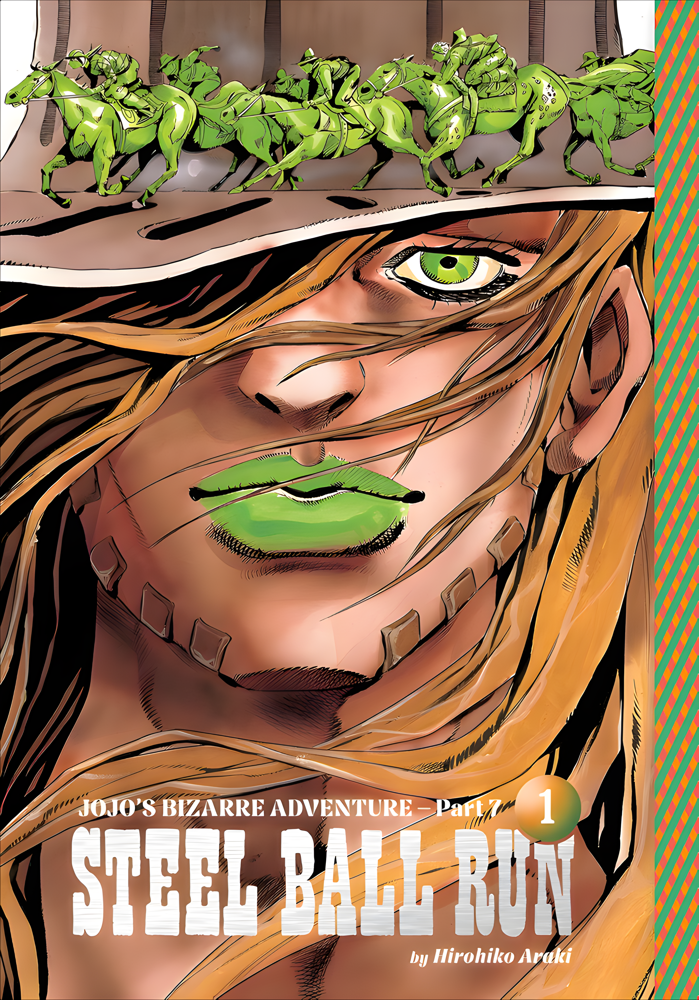

# ✨ Real-ESRGAN Image Upscaler (Streamlit + ONNX)

A local-first image super-resolution app. Upload an image, get it upscaled
**4x** using the Real-ESRGAN x4plus ONNX model — runs entirely on ONNX
Runtime, no external API calls or keys required.

[](https://enhance0io.streamlit.app/)


**🔗 Try it live: [enhance0io.streamlit.app](https://enhance0io.streamlit.app/)**

---

## Example

<!--
  Replace before.jpg / after.png in assets/ with your own pair — see
  "Adding your own example image" below.
-->

<table>
<tr>
<th>Before</th>
<th>After (4x)</th>
</tr>
<tr>
<td></td>
<td></td>
</tr>
</table>

---

## Features

- **4x super-resolution** via the Real-ESRGAN x4plus ONNX model
- **Tiled inference** — handles images of any size despite the model's fixed
  128x128 → 512x512 input/output, with feathered blending so tile seams don't show
- **Alpha channel support** — transparent PNGs stay transparent
- **CPU or GPU** — auto-detects available ONNX Runtime execution providers
- **Batched tile inference** for faster processing on models/hardware that support it
- **Progress tracking** with live time-remaining estimate
- **PNG or JPEG export**, with quality control for JPEG

## Project structure

```
project/
├── app.py                          # Streamlit frontend
├── upscaler.py                     # Core tiling/inference engine
├── requirements.txt
├── assets/                         # Example before/after image (add your own)
│   ├── before.jpg
│   └── after.png
├── model/
│   ├── real_esrgan_x4plus.onnx
│   └── real_esrgan_x4plus.data     # external weights, must stay next to the .onnx file
└── README.md
```

## Requirements

- Python 3.10+
- The Real-ESRGAN x4plus ONNX model files (`.onnx` + `.data`) placed in `model/`
- (Optional) An NVIDIA GPU + CUDA for faster inference

## Setup

```bash
git clone <https://github.com/Deshmukh-Anurag-25/ImageEnhancer>
cd project

python -m venv venv
source venv/bin/activate   # Windows: venv\Scripts\activate

pip install -r requirements.txt
```

Place `real_esrgan_x4plus.onnx` and `real_esrgan_x4plus.data` in `model/`.
Both files are required — the `.onnx` file references the `.data` file for
its weights and won't load without it.

## Run locally

```bash
streamlit run app.py
```

Then open the URL Streamlit prints (usually http://localhost:8501).

Or skip setup entirely and use the hosted version: **[enhance0io.streamlit.app](https://enhance0io.streamlit.app/)**

## Usage

1. Upload an image (PNG, JPG, JPEG, WEBP, or BMP).
2. Adjust tile overlap, batch size, or execution provider in the sidebar if needed.
3. Click **Upscale 4x**.
4. Download the result as PNG or JPEG.

## How it works

The ONNX model only accepts a fixed **128x128** input and always produces a
fixed **512x512** output (exactly 4x). To support images of any size,
`upscaler.py`:

1. Pads the image so it's covered by an integer number of tile positions
   (using reflect padding, with a safe fallback for images smaller than one tile).
2. Slides a 128x128 window across it with a configurable overlap.
3. Runs tiles through the model, optionally batched for speed.
4. Blends overlapping output tiles with a feathered (raised-cosine) mask so
   tile seams don't show.
5. Crops the result back to exactly `original_size * 4`.

Larger images take proportionally longer since more tiles are needed — the
UI's progress bar tracks this and estimates remaining time.

## GPU acceleration

By default the app runs on CPU. To use an NVIDIA GPU:

```bash
pip uninstall onnxruntime
pip install onnxruntime-gpu
```

Then pick `CUDAExecutionProvider` from the **Execution provider** dropdown in
the sidebar — no code changes needed, the app detects available providers
automatically. (Note: the hosted demo runs on CPU.)

## Configuration / tuning notes

| Setting | Where | Notes |
|---|---|---|
| `MAX_INPUT_DIM` | `app.py` | Caps uploads at 1024px on the long side before upscaling, to keep things responsive on CPU. Raise or remove if you have the compute budget. |
| Tile overlap | Sidebar slider | 0 is fastest but may show faint grid seams on flat/smooth images; 16–32px is a good quality/speed balance. |
| Batch size | Sidebar slider | Only helps if the ONNX model has a dynamic batch dimension; otherwise falls back to 1 automatically. |

## Troubleshooting

- **`st.image(...) TypeError`** — you're likely on an older Streamlit version.
  Run `pip install -U streamlit`; the app handles both old and new versions
  automatically, but very old installs may need updating for other features too.
- **Model fails to load / `.data` file not found** — make sure both the
  `.onnx` and `.data` files are in `model/` with their original filenames intact.
- **`ValueError` on very small images** — fixed in the current `upscaler.py`
  via safe reflect padding; make sure you're on the latest version of the file.
- **Slow on CPU** — lower the overlap, reduce `MAX_INPUT_DIM`, or switch to
  `onnxruntime-gpu` if you have a compatible GPU.

## Adding your own example image

1. Pick a source image with visible fine detail (text, fabric weave, hair, foliage).
2. Run it through the app once to get the 4x result.
3. Save the original as `assets/before.jpg` and the result as `assets/after.png`.
4. For the most convincing comparison, crop both images to the same small
   region before saving — a tight crop shows the 4x difference far more
   clearly than a full-size photo that already looks fine at a glance.

## Roadmap / known limitations

- No batch/queue processing for multiple images at once
- No face-restoration pass (e.g. GFPGAN) for portraits
- CPU inference on large images can still be slow; no background job queue yet

## License

MIT — see `LICENSE`.